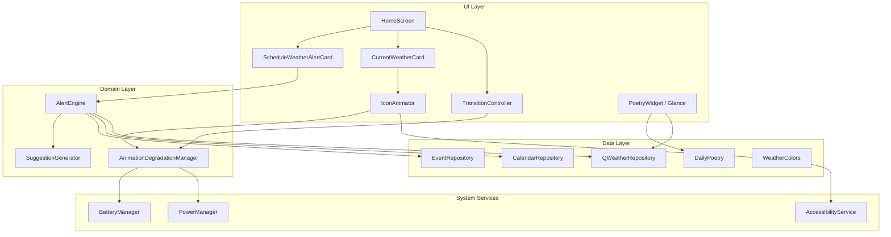
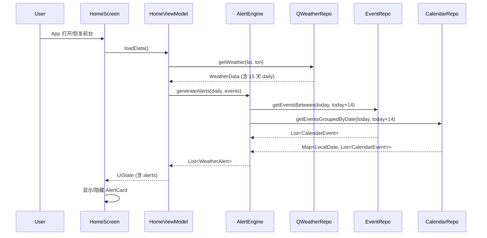

# Design Document: v2-enhancements

## Overview

知天 v2 增强功能批次包含五个子特性，围绕"轻量、内敛、高效"的核心理念，在不增加认知负担的前提下提升信息密度和视觉品质：

1. **日程天气预警 (Schedule Weather Alert)** — Alert_Engine 将未来 15 天日程与天气预报交叉匹配，生成预警卡片
2. **诗词桌面小组件 (Poetry Widget)** — 基于 Jetpack Glance 的独立 Widget，每日展示一句古诗词
3. **天气图标微动画 (Icon Animator)** — Compose Canvas 绘制 64dp 天气图标的轻量无限动画
4. **天气转场动画 (Transition Controller)** — 背景渐变色 600-800ms ease-in-out 平滑过渡
5. **动画降级策略 (Animation Degradation)** — 低电量/省电模式自动降级动画

技术栈：Kotlin, Jetpack Compose, Hilt DI, Room DB, Jetpack Glance (Widget), Compose Canvas (Animation)

## Architecture

### 高层架构图



### 数据流



## Components and Interfaces

### 1. Alert Engine (日程天气预警)

#### 新增文件

| 文件路径 | 职责 |
|---------|------|
| `domain/alert/AlertEngine.kt` | 核心匹配逻辑：事件 × 天气 → 预警列表 |
| `domain/alert/SuggestionGenerator.kt` | 根据 Bad_Weather 类型生成建议文本 |
| `domain/alert/WeatherAlert.kt` | 预警数据模型 |
| `ui/home/ScheduleWeatherAlertCard.kt` | 预警卡片 Composable |

#### 接口定义

```kotlin
// domain/alert/WeatherAlert.kt
data class WeatherAlert(
    val eventName: String,          // 事件名（截断至 20 字符）
    val eventDate: LocalDate,
    val eventTime: LocalTime?,      // null = 全天事件
    val weatherLabel: String,       // "雨", "雷暴", "雪" 等
    val triggerMetric: String,      // "最高温 37°C", "风速 42km/h" 等
    val suggestion: String,         // 建议文本（≤30 字符）
    val relativeDateText: String,   // "今天", "明天", "后天", "3天后"
)

// domain/alert/AlertEngine.kt
class AlertEngine @Inject constructor(
    private val eventRepository: EventRepository,
    private val calendarRepository: CalendarRepository,
    private val suggestionGenerator: SuggestionGenerator,
) {
    suspend fun generateAlerts(
        dailyForecasts: List<DailyWeather>,
    ): List<WeatherAlert>
}

// domain/alert/SuggestionGenerator.kt
object SuggestionGenerator {
    fun getSuggestion(conditions: List<BadWeatherCondition>): String
}

sealed class BadWeatherCondition(val priority: Int) {
    data object Stormy : BadWeatherCondition(1)
    data object Snowy : BadWeatherCondition(2)
    data object Rainy : BadWeatherCondition(3)
    data class StrongWind(val speed: Int) : BadWeatherCondition(4)
    data class ExtremeHeat(val temp: Int) : BadWeatherCondition(5)
    data class ExtremeCold(val temp: Int) : BadWeatherCondition(6)
}
```

#### DailyWeather 模型扩展

当前 `DailyWeather` 缺少 `windSpeed` 字段。需要扩展：

```kotlin
data class DailyWeather(
    val date: LocalDate,
    val condition: WeatherCondition,
    val tempMin: Int,
    val tempMax: Int,
    val windSpeed: Int = 0,  // 新增：每日最大风速 km/h
)
```

同时需要在 `QWeatherRepository` 的 daily 解析中提取 `windSpeedDay` 字段。

### 2. Poetry Widget (诗词小组件)

#### 新增文件

| 文件路径 | 职责 |
|---------|------|
| `widget/PoetryWidget.kt` | Glance AppWidget 内容定义 |
| `widget/PoetryWidgetReceiver.kt` | GlanceAppWidgetReceiver 入口 |
| `res/xml/poetry_widget_info.xml` | Widget 元数据 XML |

#### 实现方案：Jetpack Glance

选择 Glance 而非 RemoteViews 的理由：
- 现有 `WeatherWidgetReceiver` 已使用 Glance，保持技术栈一致
- Glance 提供 Compose-like 声明式 API，开发效率高
- 支持 Material 3 主题和响应式布局

```kotlin
// widget/PoetryWidget.kt
class PoetryWidget : GlanceAppWidget() {
    override suspend fun provideGlance(context: Context, id: GlanceId) {
        provideContent {
            PoetryWidgetContent()
        }
    }
}

// widget/PoetryWidgetReceiver.kt
class PoetryWidgetReceiver : GlanceAppWidgetReceiver() {
    override val glanceAppWidget: GlanceAppWidget = PoetryWidget()
}
```

#### 数据获取策略

Poetry Widget 数据获取流程：
1. 从 SharedPreferences 读取缓存的天气条件（由 App 主流程写入）
2. 调用 `DailyPoetry.getPoetry(today, condition)` 获取诗词
3. 如果天气条件不可用，使用 `WeatherCondition.SUNNY` 作为默认值
4. 缓存上次成功加载的诗词内容作为 fallback

#### 刷新机制

- 注册 `ACTION_DATE_CHANGED` 广播监听日期变化
- 使用 `updatePeriodMillis` 设置为 86400000ms (24h) 作为保底刷新
- App 前台刷新天气时同步触发 Widget 更新

### 3. Icon Animator (天气图标微动画)

#### 新增文件

| 文件路径 | 职责 |
|---------|------|
| `ui/components/WeatherIconAnimator.kt` | 64dp 图标动画 Composable |
| `ui/components/IconAnimationState.kt` | 动画状态管理（暂停/恢复/降级） |

#### 动画架构

```mermaid
statechart-v2
    [*] --> Active
    Active --> Paused : App 进入后台
    Paused --> Active : App 回到前台
    Active --> Static : Reduced_Motion 开启 / 低电量 / 省电模式
    Static --> Active : 条件恢复
    Paused --> Static : 条件变化
```

#### 设计决策

- **不复用 WeatherAnimationOverlay**：现有 Overlay 是全屏粒子效果（80+ 粒子），Icon Animator 是 64dp 局部微动画（≤5 粒子），职责和性能约束完全不同
- **使用 `rememberInfiniteTransition`**：自动跟随 Compose 生命周期暂停/恢复
- **Canvas 绘制**：直接在 64dp 区域内绘制，不使用外部动画库
- **帧率控制**：通过 `tween` duration 控制动画速度，Compose 框架自动处理 16ms 帧间隔

#### 各天气类型动画规格

| 天气 | 动画效果 | 粒子数 | 周期 |
|------|---------|--------|------|
| SUNNY | 光芒脉冲透明度 | — | 3-5s |
| CLOUDY/PARTLY_CLOUDY | 云朵水平漂移 | ≤3 层 | ≤20dp/s |
| RAINY/DRIZZLE | 雨滴下落 | 3-5 | 循环 |
| SNOWY | 雪花飘落+横摆 | 3-5 | 循环 |
| STORMY | 闪电闪烁 | — | 3-7s 间隔 |
| FOGGY | 薄雾层流动 | ≤3 层 | 缓慢 |

### 4. Transition Controller (天气转场动画)

#### 新增文件

| 文件路径 | 职责 |
|---------|------|
| `ui/components/WeatherTransitionController.kt` | 渐变色过渡逻辑 |

#### 实现方案

使用 Compose `animateColorAsState` 实现渐变色平滑过渡：

```kotlin
@Composable
fun AnimatedWeatherBackground(
    condition: WeatherCondition,
    isDay: Boolean,
    degraded: Boolean,  // 降级模式
    content: @Composable () -> Unit,
) {
    val targetGradient = WeatherColors.gradientFor(condition, isDay)
    val duration = if (degraded) 200 else 700  // 降级时 200ms，正常 700ms

    val startColor by animateColorAsState(
        targetValue = targetGradient.start,
        animationSpec = tween(durationMillis = duration, easing = EaseInOut),
        label = "gradient_start",
    )
    val endColor by animateColorAsState(
        targetValue = targetGradient.end,
        animationSpec = tween(durationMillis = duration, easing = EaseInOut),
        label = "gradient_end",
    )

    Box(
        modifier = Modifier
            .fillMaxSize()
            .background(Brush.verticalGradient(listOf(startColor, endColor)))
    ) {
        content()
    }
}
```

#### 中断处理

`animateColorAsState` 天然支持中断：当 target 在动画进行中变化时，会从当前插值颜色开始新的过渡，无需额外处理。

### 5. Animation Degradation Manager (动画降级)

#### 新增文件

| 文件路径 | 职责 |
|---------|------|
| `domain/animation/AnimationDegradationManager.kt` | 降级状态管理 |

#### 接口定义

```kotlin
@Singleton
class AnimationDegradationManager @Inject constructor(
    @ApplicationContext private val context: Context,
) {
    data class DegradationState(
        val iconAnimationEnabled: Boolean = true,
        val transitionDuration: Int = 700,  // ms
        val reason: DegradationReason = DegradationReason.NONE,
    )

    enum class DegradationReason {
        NONE, LOW_BATTERY, POWER_SAVING
    }

    // StateFlow，UI 层 collect
    val state: StateFlow<DegradationState>

    // 在 App resume 时调用
    fun checkAndUpdate()
}
```

#### 降级规则

| 条件 | Icon Animator | Transition Controller |
|------|--------------|----------------------|
| 正常 | 全动画 | 700ms ease-in-out |
| 电量 < 15% | 静态图标 | 200ms |
| 省电模式 | 静态图标 | 即时切换（0ms） |
| 电量 > 20% 且非省电 | 恢复全动画 | 恢复 700ms |

检测方式：
- `BatteryManager.EXTRA_LEVEL` / `EXTRA_SCALE` 计算电量百分比
- `PowerManager.isPowerSaveMode` 检测省电模式
- 在 `Activity.onResume()` 时轮询一次

## Data Models

### 新增模型

```kotlin
// domain/alert/WeatherAlert.kt
data class WeatherAlert(
    val eventName: String,
    val eventDate: LocalDate,
    val eventTime: LocalTime?,
    val weatherLabel: String,
    val triggerMetric: String,
    val suggestion: String,
    val relativeDateText: String,
)

// domain/alert/BadWeatherCondition.kt
sealed class BadWeatherCondition(val priority: Int) {
    data object Stormy : BadWeatherCondition(1)
    data object Snowy : BadWeatherCondition(2)
    data object Rainy : BadWeatherCondition(3)
    data class StrongWind(val speed: Int) : BadWeatherCondition(4)
    data class ExtremeHeat(val temp: Int) : BadWeatherCondition(5)
    data class ExtremeCold(val temp: Int) : BadWeatherCondition(6)
}
```

### 模型变更

```kotlin
// DailyWeather 新增字段
data class DailyWeather(
    val date: LocalDate,
    val condition: WeatherCondition,
    val tempMin: Int,
    val tempMax: Int,
    val windSpeed: Int = 0,  // 新增：每日最大风速 km/h
)
```

### HomeUiState 扩展

```kotlin
data class HomeUiState(
    // ... 现有字段 ...
    val weatherAlerts: List<WeatherAlert> = emptyList(),  // 新增
    val animationDegraded: Boolean = false,               // 新增
    val iconAnimationEnabled: Boolean = true,             // 新增
)
```


## Correctness Properties

*A property is a characteristic or behavior that should hold true across all valid executions of a system — essentially, a formal statement about what the system should do. Properties serve as the bridge between human-readable specifications and machine-verifiable correctness guarantees.*

### Property 1: Alert generation produces alerts only for events on bad-weather days

*For any* set of calendar events and daily weather forecasts, the Alert_Engine SHALL produce alerts if and only if an event's date matches a day classified as Bad_Weather (RAINY, STORMY, SNOWY, tempMax > 35°C, tempMin < -10°C, or windSpeed > 39 km/h), and SHALL produce exactly one alert per event on such days.

**Validates: Requirements 1.1, 1.3, 1.4, 1.5**

### Property 2: Alert field completeness

*For any* generated WeatherAlert, all fields SHALL be non-empty: eventName (≤20 characters, with ellipsis if truncated), eventDate (valid LocalDate), weatherLabel (matching the condition's label), triggerMetric (describing the triggering threshold), suggestion (valid suggestion string), and relativeDateText (one of "今天", "明天", "后天", or "N天后").

**Validates: Requirements 1.2, 2.2**

### Property 3: Alert display ordering and capping

*For any* list of WeatherAlerts, the displayed list SHALL be sorted chronologically by event date (then by event time, with all-day events before timed events) and capped at a maximum of 5 entries.

**Validates: Requirements 2.4**

### Property 4: Suggestion mapping correctness

*For any* single BadWeatherCondition, the SuggestionGenerator SHALL return the exact predefined suggestion string: RAINY/DRIZZLE → "建议带伞或调整出行时间", STORMY → "建议改期或选择室内场所", SNOWY → "注意保暖和路面结冰", ExtremeHeat → "注意防暑降温，避免长时间户外活动", ExtremeCold → "注意防寒保暖", StrongWind → "注意防风，避免高空作业或户外活动".

**Validates: Requirements 3.1, 3.2, 3.3, 3.4, 3.5, 3.6**

### Property 5: Suggestion priority selection

*For any* combination of multiple BadWeatherConditions on the same day, the SuggestionGenerator SHALL select the suggestion corresponding to the highest-priority condition using the order: STORMY (1) > SNOWY (2) > RAINY/DRIZZLE (3) > StrongWind (4) > ExtremeHeat (5) > ExtremeCold (6).

**Validates: Requirements 3.7**

### Property 6: Suggestion length invariant

*For any* generated suggestion string, its character length SHALL be less than or equal to 30.

**Validates: Requirements 3.8**

### Property 7: Poetry daily uniqueness

*For any* date `d` and weather condition `c`, the poetry returned by `DailyPoetry.getPoetry(d, c)` SHALL differ from `DailyPoetry.getPoetry(d + 1, c)` (consecutive days with the same condition produce different poems).

**Validates: Requirements 5.1**

### Property 8: Reduced motion disables icon animation

*For any* WeatherCondition, when the system Reduced_Motion accessibility setting is enabled, the Icon_Animator SHALL render a static icon with no active animation transitions.

**Validates: Requirements 7.4**

### Property 9: Icon particle count caps

*For any* WeatherCondition, the Icon_Animator SHALL not exceed the particle caps: raindrops ≤ 5, snowflakes ≤ 5, cloud layers ≤ 3.

**Validates: Requirements 7.6**

### Property 10: Animation degradation state correctness

*For any* combination of battery level (0-100) and power-saving mode (on/off), the AnimationDegradationManager SHALL produce the correct degradation state:
- Battery < 15%: iconAnimationEnabled = false, transitionDuration = 200ms
- Power-saving mode active: iconAnimationEnabled = false, transitionDuration = 0ms
- Battery ≥ 20% AND power-saving off: iconAnimationEnabled = true, transitionDuration = 700ms
- Battery in [15%, 20%) AND power-saving off: maintain current state (hysteresis)

**Validates: Requirements 9.1, 9.2, 9.3, 9.4, 9.5**

## Error Handling

### Alert Engine

| 场景 | 处理策略 |
|------|---------|
| QWeatherRepository 返回失败 | 跳过预警生成，返回空列表，不崩溃 |
| CalendarRepository 权限被拒 | 仅使用 EventRepository 数据生成预警 |
| EventRepository 查询失败 | 仅使用 CalendarRepository 数据生成预警 |
| 两个数据源都失败 | 返回空预警列表 |
| DailyWeather 缺少 windSpeed | 默认 windSpeed = 0，不触发强风预警 |

### Poetry Widget

| 场景 | 处理策略 |
|------|---------|
| 天气条件不可用 | 使用 WeatherCondition.SUNNY 作为默认 |
| DailyPoetry 返回空内容 | 显示上次成功加载的诗词（SharedPreferences 缓存） |
| Widget 刷新失败 | 保持当前显示内容不变 |

### Icon Animator

| 场景 | 处理策略 |
|------|---------|
| Canvas 绘制异常 | 捕获异常，回退到静态图标 |
| 系统无障碍设置变化 | 立即切换到静态模式，无需重启 |

### Transition Controller

| 场景 | 处理策略 |
|------|---------|
| 快速连续切换城市 | animateColorAsState 自动从当前插值开始新过渡 |
| 降级模式切换 | 下次条件变化时使用新的 duration |

### Animation Degradation

| 场景 | 处理策略 |
|------|---------|
| BatteryManager 不可用 | 默认为正常模式（不降级） |
| PowerManager 不可用 | 默认为正常模式（不降级） |
| 电量在 15%-20% 之间 | 保持当前状态（滞后区间，避免频繁切换） |

## Testing Strategy

### 单元测试 (Unit Tests)

重点覆盖：
- `AlertEngine.generateAlerts()` — 各种事件/天气组合的具体场景
- `SuggestionGenerator.getSuggestion()` — 每种天气类型的建议映射
- `BadWeatherCondition` 分类逻辑 — 边界值（35°C, -10°C, 39km/h）
- `AnimationDegradationManager.checkAndUpdate()` — 各电量/省电组合
- 相对日期文本生成 — "今天"/"明天"/"后天"/"N天后"
- 事件名截断逻辑 — 20 字符边界

### 属性测试 (Property-Based Tests)

使用 **Kotest** 的 property testing 模块（`io.kotest:kotest-property`）。

配置：
- 每个属性测试最少运行 **100 次迭代**
- 每个测试标注对应的设计文档属性编号
- 标签格式：`Feature: v2-enhancements, Property {N}: {property_text}`

覆盖的属性：
1. Alert generation correctness (Property 1)
2. Alert field completeness (Property 2)
3. Alert ordering and capping (Property 3)
4. Suggestion mapping (Property 4)
5. Suggestion priority (Property 5)
6. Suggestion length invariant (Property 6)
7. Poetry daily uniqueness (Property 7)
8. Animation degradation state (Property 10)

注：Property 8 (Reduced Motion) 和 Property 9 (Particle Caps) 由于涉及 Compose UI 运行时，更适合用 Compose UI 测试框架验证，不纳入纯属性测试。

### 集成测试 (Integration Tests)

- Widget 刷新机制：日期变化广播 → 内容更新
- 生命周期：App 前后台切换 → 动画暂停/恢复
- 端到端：HomeViewModel 加载数据 → 预警卡片显示

### UI 测试 (Compose UI Tests)

- ScheduleWeatherAlertCard 显示/隐藏逻辑
- WeatherIconAnimator 各天气类型渲染
- AnimatedWeatherBackground 渐变过渡
- PoetryWidget Glance 内容渲染

### 性能测试

- Icon_Animator 帧渲染时间 < 8ms（Benchmark）
- 每帧绘制操作数 ≤ 20（Canvas 操作计数）
